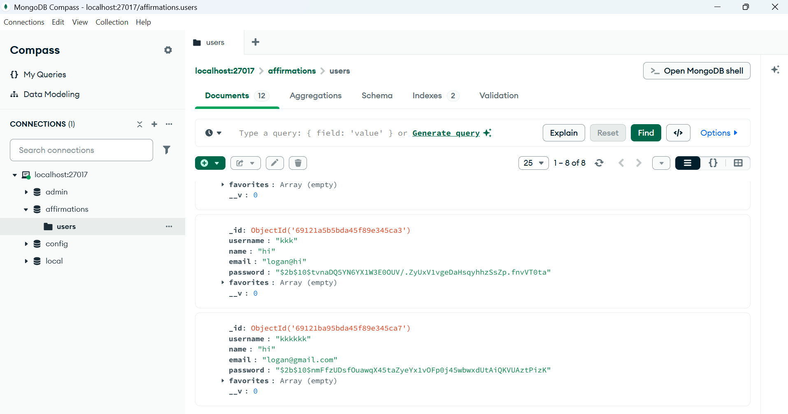

# 🌸 Daily Affirmations Web App

A full-stack web application that provides positive daily affirmations.  
Users can **sign up, log in using email or username**, and access a personalized affirmation dashboard.  
The application is built using **React**, **Node.js**, **Express**, and **MongoDB (Compass)**.

---

## ✨ Features

| Feature | Description |
|--------|-------------|
| Create Account | User signup with **username, name, email, password** |
| Login via Username or Email | More flexible and user-friendly authentication |
| Protected Dashboard | Only logged-in users can view affirmations |
| Personalized Navbar | Shows **Hello, @username** |
| New Affirmation Button | Shows a fresh positive affirmation each time |
| Secure Session | Authentication handled using **JWT** |
| Logout | Clears session & redirects to login |
| Tailwind UI | Clean, modern, aesthetic UI |

---

## 🛠️ Tech Stack

### **Frontend**
- React (Vite)
- React Router
- Tailwind CSS
- Axios

### **Backend**
- Node.js
- Express.js
- JWT Authentication
- bcrypt

### **Database**
- MongoDB (via **MongoDB Compass** local database)

---

## 📸 Screenshots

## 📁 Project Folder Structure

